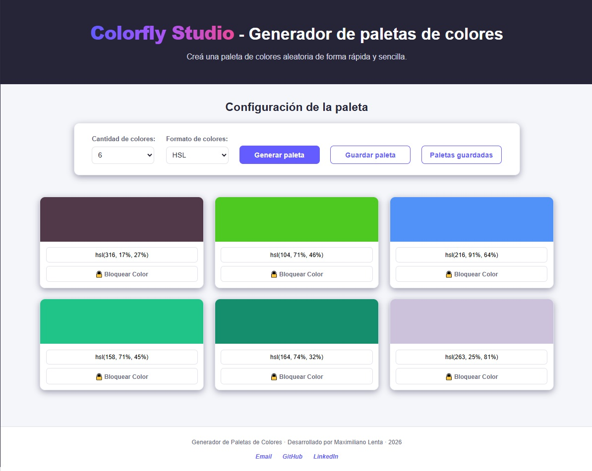
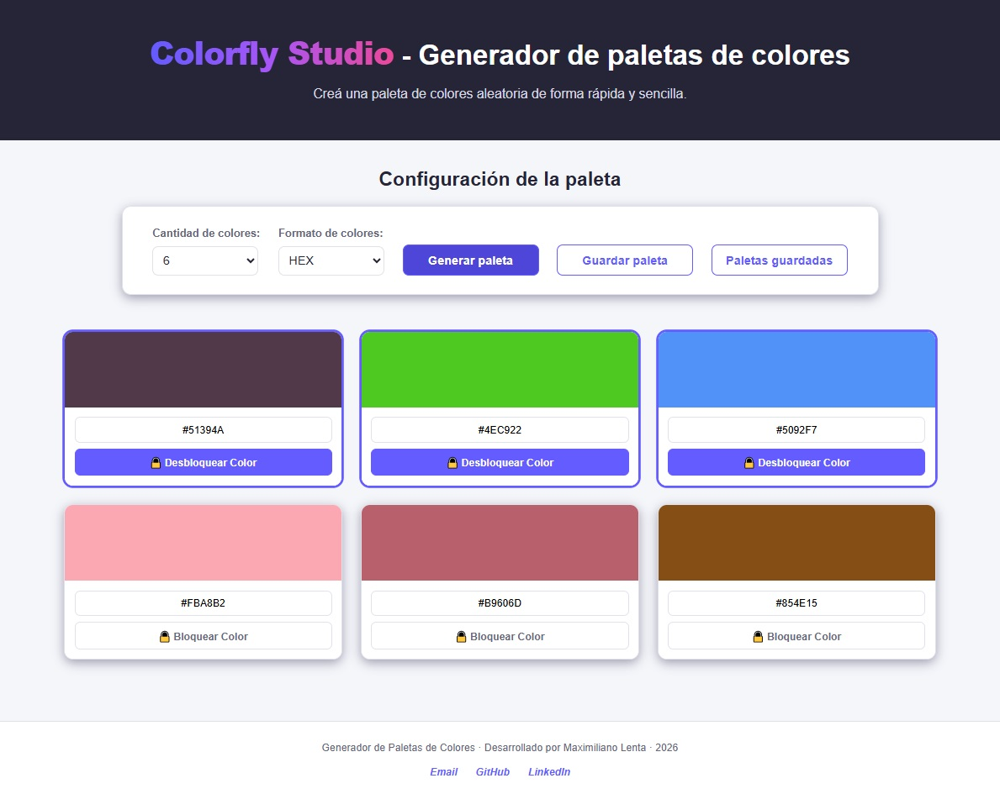
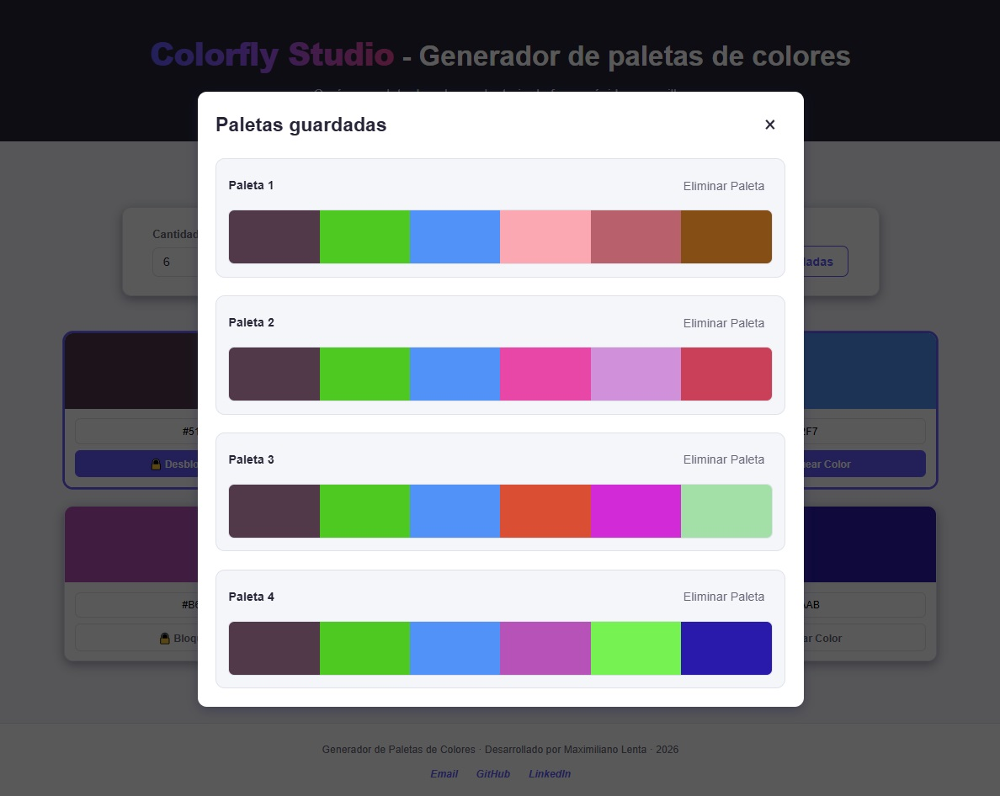
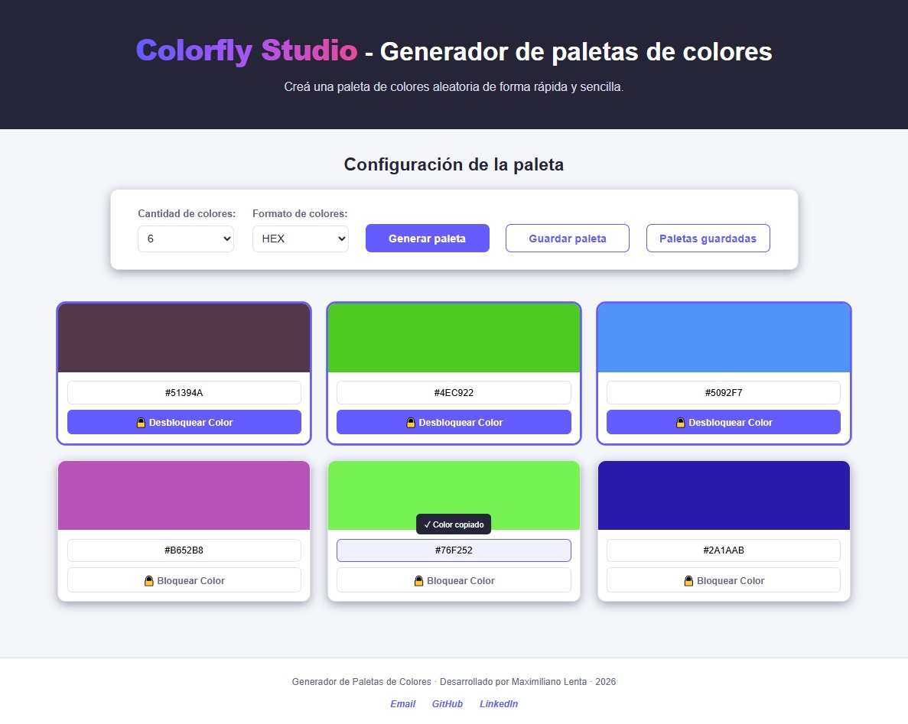
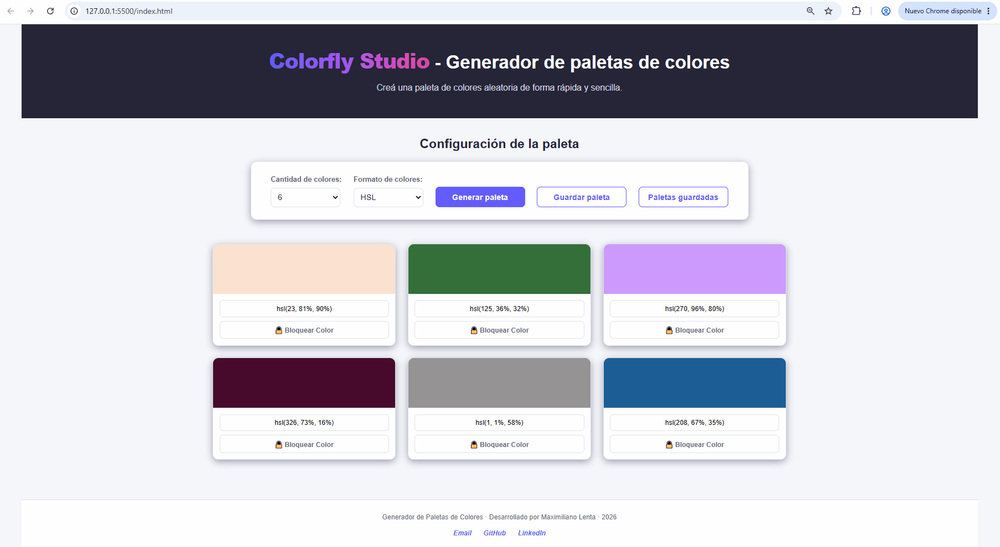

# Generador de Paletas Interactivo

## Contexto del proyecto

**Colorfly Studio** es una agencia de branding que produce propuestas visuales para más de 300 clientes en distintas ciudades. Para acelerar el flujo creativo del equipo y estandarizar las propuestas iniciales, la empresa necesita una herramienta web simple que permita generar paletas de colores de forma rápida e intuitiva.

Este proyecto fue desarrollado como parte del **Módulo 1 - Fundamentos del Desarrollo Web de Soy Henry**, tomando como base el escenario planteado para **Colorfly Studio**.

La aplicación permite generar paletas de colores aleatorias, seleccionando la cantidad de colores y el formato en el que se desean visualizar: **HSL o HEX**.

## 📑 Índice

* [🚀 Demo en vivo](#-demo-en-vivo)
* [🚀 Funcionalidades](#-funcionalidades)

  * [Funcionalidades principales](#funcionalidades-principales)
  * [Funcionalidades adicionales](#funcionalidades-adicionales)
* [🛠️ Tecnologías utilizadas](#️-tecnologías-utilizadas)
* [📁 Estructura del proyecto](#-estructura-del-proyecto)
* [📥 Instalación y ejecución local](#-instalación-y-ejecución-local)
* [📖 Instrucciones de uso](#-instrucciones-de-uso)
* [🌐 Despliegue](#-despliegue)
* [💡 Decisiones técnicas](#-decisiones-técnicas)

  * [HTML](#html)
  * [CSS](#css)
  * [JavaScript](#javascript)
  * [Persistencia](#persistencia)
  * [Portapapeles](#portapapeles)
* [📸 Capturas y flujo principal](#-capturas-y-flujo-principal)
* [🤖 Uso de inteligencia artificial](#-uso-de-inteligencia-artificial)
* [🔮 Mejoras futuras](#-mejoras-futuras)
* [👨‍💻 Autor](#-autor)

## 🚀 Demo en vivo

👉 [**Probar Generador de Paletas Interactivo**](https://lenta-maximiliano.github.io/ProyectoM1_MaximilianoLenta/)

El proyecto se encuentra desplegado mediante **GitHub Pages**, por lo que puede utilizarse directamente desde el navegador sin necesidad de instalar dependencias.

## 🚀 Funcionalidades

### Funcionalidades principales

* Generación aleatoria de paletas de colores.
* Selección de 6, 8 o 9 colores.
* Visualización de colores en formato HSL o HEX.
* Generación automática de una paleta inicial al cargar la página.
* Interfaz responsive para diferentes tamaños de pantalla.
* Feedback visual para determinadas acciones.
* Controles accesibles mediante teclado y estados de foco visibles.

### Funcionalidades adicionales

* Bloqueo de colores para conservarlos al generar una nueva paleta.
* Guardado de paletas mediante `localStorage`.
* Visualización de las paletas guardadas.
* Eliminación de paletas guardadas mediante confirmación.
* Copiado de códigos de color al portapapeles.
* Feedback visual al copiar un código.
* Conversión entre los formatos HSL y HEX.

## 🛠️ Tecnologías utilizadas

* HTML5
* CSS3
* JavaScript
* Git
* GitHub
* GitHub Pages
* LocalStorage
* Clipboard API

El proyecto fue desarrollado con **JavaScript Vanilla**, sin frameworks, librerías externas ni dependencias de terceros.

## 📁 Estructura del proyecto

```text
ProyectoM1_MaximilianoLenta/
├── css/
│   └── styles.css
├── img/
│   └── favicon.svg
├── js/
│   └── script.js
├── documentacion/
│   ├── capturas/
│   │   ├── 01-generacion-paleta.png
│   │   ├── 02-formatos-colores.png
│   │   ├── 03-colores-bloqueados.png
│   │   ├── 04-paletas-guardadas.png
│   │   ├── 05-feedback-copiar.png
│   │   └── flujo-principal.gif
│   └── ia/
│       ├── README.md
│       └── capturas/
│           ├── 01-prompt-generacion-conversion-colores.jpg
│           ├── 02-generar-colores-hsl.jpg
│           ├── 03-generar-colores-hex.jpg
│           ├── 04-rgb-formato-intermedio.jpg
│           ├── 05-prompt-copiar-colores.jpg
│           ├── 06-clipboard-api.jpg
│           ├── 07-prompt-guardado-paletas.jpg
│           ├── 08-guardar-paletas.jpg
│           └── 09-gestion-paletas-guardadas.jpg
├── index.html
└── README.md
```


## 📥 Instalación y ejecución local

Para trabajar con el proyecto de forma local, es necesario tener instalado [Git](https://git-scm.com/).

### 1. Clonar el repositorio

```bash
git clone https://github.com/Lenta-Maximiliano/ProyectoM1_MaximilianoLenta.git
```

### 2. Ingresar al directorio del proyecto

```bash
cd ProyectoM1_MaximilianoLenta
```

### 3. Ejecutar el proyecto

El proyecto no requiere la instalación de dependencias ni herramientas adicionales.

Una vez clonado el repositorio, se puede abrir directamente el archivo `index.html` en un navegador web.

## 📖 Instrucciones de uso

1. Seleccionar la cantidad de colores que tendrá la paleta.
2. Seleccionar el formato de visualización: HSL o HEX.
3. Presionar el botón **"Generar paleta"**.
4. La aplicación generará una nueva paleta de colores aleatoria.
5. Para conservar un color, utilizar el botón **"Bloquear Color"**.
6. Los códigos HSL y HEX pueden copiarse al portapapeles haciendo clic sobre ellos.
7. Utilizar **"Guardar paleta"** para almacenar la paleta actual.
8. Acceder a **"Paletas guardadas"** para consultar las paletas almacenadas.
9. Las paletas guardadas pueden eliminarse mediante la opción correspondiente.

La aplicación genera automáticamente una paleta inicial al cargar la página.

## 🌐 Despliegue

El proyecto se encuentra desplegado mediante **GitHub Pages**.

Al tratarse de una aplicación estática desarrollada con HTML, CSS y JavaScript, no requiere servidor ni proceso de compilación para su ejecución.

### Publicar una copia del proyecto

Si querés desplegar tu propia versión utilizando GitHub Pages:

1. **Crear un repositorio en GitHub** para tu copia del proyecto.

2. **Clonar este repositorio** en tu computadora:

```bash
git clone https://github.com/Lenta-Maximiliano/ProyectoM1_MaximilianoLenta.git
cd ProyectoM1_MaximilianoLenta
```

3. **Conectar el proyecto con tu propio repositorio:**

```bash
git remote remove origin
git remote add origin https://github.com/TU-USUARIO/TU-REPOSITORIO.git
```

4. **Subir el proyecto a GitHub:**

```bash
git add .
git commit -m "feat: publica proyecto"
git push -u origin main
```

> Si tu rama principal tiene otro nombre, reemplazá `main` por el nombre correspondiente.

5. **Activar GitHub Pages:**

   * Ingresar a **Settings** del repositorio.
   * Seleccionar **Pages**.
   * En **Build and deployment**, seleccionar **Deploy from a branch**.
   * Elegir la rama `main`.
   * Seleccionar la carpeta `/ (root)`.
   * Presionar **Save**.

6. Una vez completado el despliegue, GitHub proporcionará una URL similar a:

```text
https://TU-USUARIO.github.io/TU-REPOSITORIO/
```

La URL dependerá del nombre de usuario y del repositorio creado.

### Demo del proyecto

* **Repositorio:** [ProyectoM1_MaximilianoLenta](https://github.com/Lenta-Maximiliano/ProyectoM1_MaximilianoLenta)
* **Demo:** [Generador de Paletas Interactivo](https://lenta-maximiliano.github.io/ProyectoM1_MaximilianoLenta/)

## 💡 Decisiones técnicas

### HTML

Se utilizó **HTML semántico** para estructurar el contenido de la aplicación, utilizando elementos como `header`, `main`, `section`, `footer`, `button`, `label` y `select`.

Los controles de selección cuentan con sus correspondientes etiquetas asociadas mediante los atributos `for` e `id`.

### CSS

Se utilizó **CSS Flexbox** para organizar los controles de configuración y **CSS Grid** para distribuir las tarjetas de colores.

También se implementaron:

* Variables CSS para reutilizar colores y valores de diseño.
* Diseño responsive mediante Media Queries.
* Estados `:focus-visible` para mejorar la navegación mediante teclado.
* Transiciones y animaciones sutiles para mejorar la interacción.
* Colores definidos principalmente mediante HSL.

### JavaScript

La lógica de la aplicación fue desarrollada utilizando JavaScript Vanilla.

Se organizaron diferentes responsabilidades mediante funciones independientes, entre ellas:

* Generación aleatoria de colores HSL.
* Generación aleatoria de colores HEX.
* Conversión de HSL a RGB.
* Conversión de RGB a HEX.
* Conversión de HEX a RGB.
* Conversión de RGB a HSL.
* Generación y renderizado dinámico de las paletas.
* Bloqueo y desbloqueo de colores.
* Gestión de paletas almacenadas.
* Copiado de códigos al portapapeles.

### Persistencia

Las paletas guardadas se almacenan utilizando **`localStorage`**, permitiendo conservarlas aunque se recargue la página.

### Portapapeles

Para copiar los códigos de color se utiliza la **Clipboard API** del navegador.

Después de copiar un código correctamente, la interfaz muestra un feedback visual indicando que el color fue copiado.

## 📸 Capturas y flujo principal

### Generación de una paleta



### Selección de formatos


### Bloqueo de colores



### Paletas guardadas



### Feedback al copiar



### Flujo principal



## 🤖 Uso de inteligencia artificial

Durante el desarrollo del proyecto se utilizó inteligencia artificial como herramienta de apoyo para:

* Resolver dudas conceptuales.
* Analizar y comprender código.
* Revisar posibles mejoras.
* Recibir orientación sobre HTML, CSS y JavaScript.
* Revisar aspectos de accesibilidad y organización del proyecto.
* Documentar decisiones técnicas.

La documentación detallada de los prompts utilizados, resultados obtenidos y su aplicación en el proyecto se encuentra en:

[Documentación del uso de IA](./documentacion/ia/README.md)

## 🔮 Mejoras futuras

Algunas posibles mejoras para futuras versiones:

* Permitir una mayor personalización de las paletas.
* Incorporar diferentes métodos de generación de colores.
* Permitir exportar una paleta completa.
* Mejorar la gestión y organización de las paletas guardadas.

## 👨‍💻 Autor

**Maximiliano Lenta**

* GitHub: [Lenta-Maximiliano](https://github.com/Lenta-Maximiliano)
* LinkedIn: [Maximiliano Lenta](https://www.linkedin.com/in/maximiliano-l-72a9b539a/)
