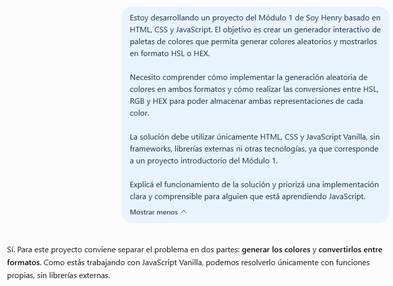
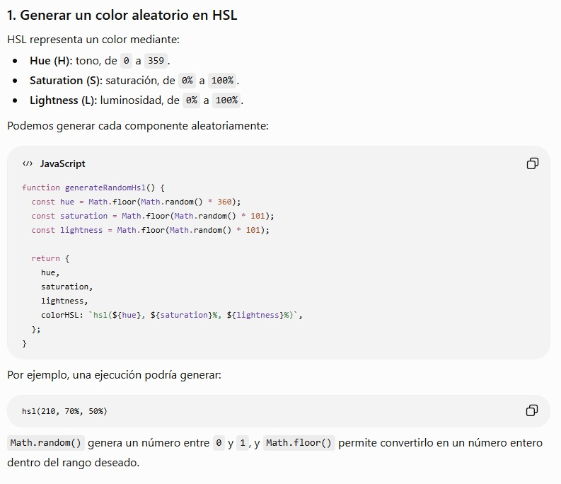
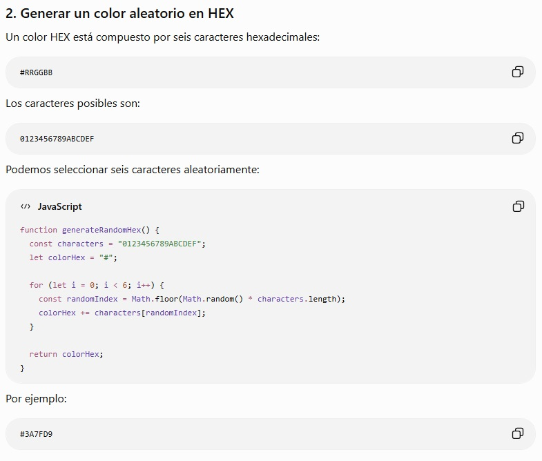
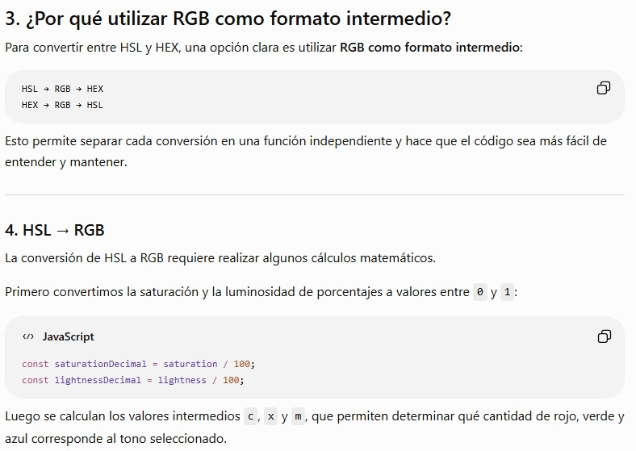
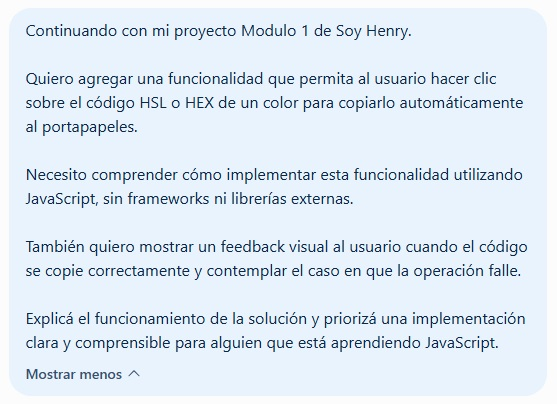
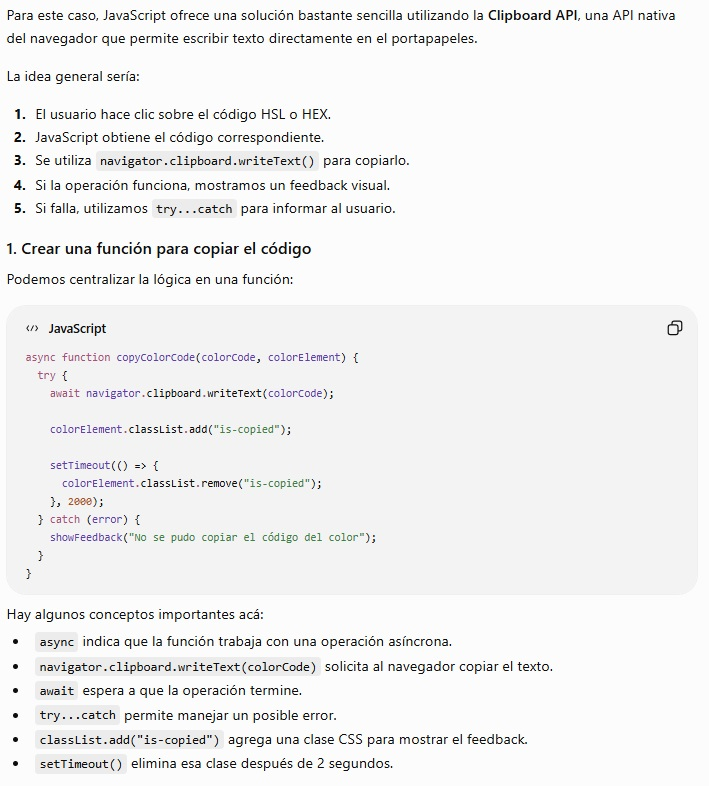
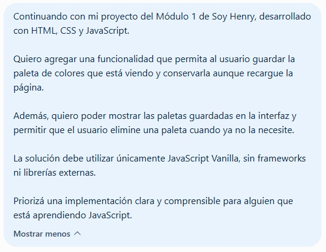
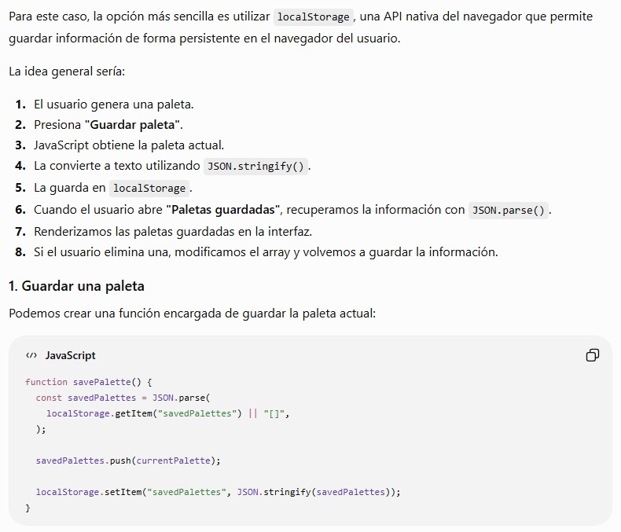
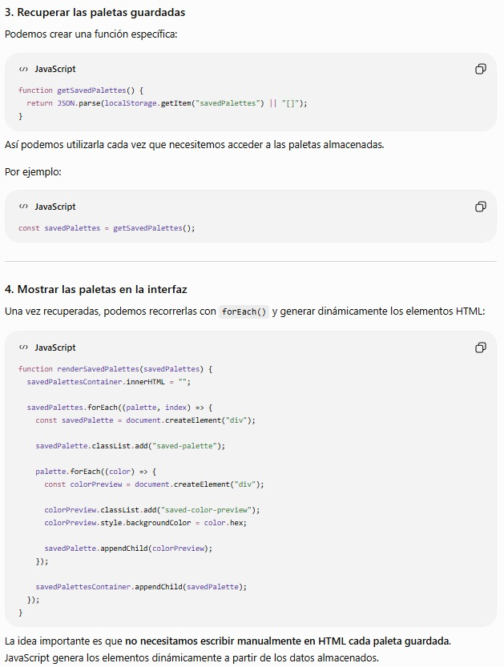

# 🤖 Documentación del uso de inteligencia artificial

Durante el desarrollo del proyecto se utilizó inteligencia artificial como herramienta de apoyo para comprender conceptos, resolver dudas técnicas y evaluar posibles implementaciones.

La IA no fue utilizada para desarrollar el proyecto de forma automática, sino como recurso complementario para comprender la lógica, analizar alternativas y adaptar las soluciones al código del proyecto.

A continuación se documentan tres casos representativos del uso de inteligencia artificial durante el desarrollo.

---

### 🎨 1. Generación y conversión de colores

#### Objetivo

Utilizar inteligencia artificial como herramienta de apoyo para comprender cómo generar colores aleatorios en HSL y HEX y cómo realizar conversiones entre HSL, RGB y HEX.

#### Prompt utilizado

> Estoy desarrollando un proyecto del Módulo 1 de Soy Henry basado en HTML, CSS y JavaScript. El objetivo es crear un generador interactivo de paletas de colores que permita generar colores aleatorios y mostrarlos en formato HSL o HEX.
>
> Necesito comprender cómo implementar la generación aleatoria de colores en ambos formatos y cómo realizar las conversiones entre HSL, RGB y HEX para poder almacenar ambas representaciones de cada color.
>
> La solución debe utilizar únicamente HTML, CSS y JavaScript Vanilla, sin frameworks, librerías externas ni otras tecnologías, ya que corresponde a un proyecto introductorio del Módulo 1.
>
> Explicá el funcionamiento de la solución y priorizá una implementación clara y comprensible para alguien que está aprendiendo JavaScript.

#### Resultado obtenido

La respuesta explicó cómo generar colores aleatorios en HSL y HEX y propuso utilizar **RGB como formato intermedio** para realizar las conversiones entre ambos formatos.

A partir de este enfoque se implementaron funciones independientes para:

* Generar colores aleatorios en HSL.
* Generar colores aleatorios en HEX.
* Convertir HSL a RGB.
* Convertir RGB a HEX.
* Convertir HEX a RGB.
* Convertir RGB a HSL.

#### Aplicación en el proyecto

El enfoque se incorporó al código de la aplicación para que cada color almacene sus representaciones HSL y HEX:

```js
{
  hsl: colorHSL,
  hex: hexColor,
  locked: false
}
```

Esto permite mostrar el formato seleccionado por el usuario sin tener que generar nuevamente la paleta.

La IA se utilizó como **herramienta de apoyo para comprender la lógica y las fórmulas de conversión**. La implementación fue revisada y adaptada al código y a las necesidades del proyecto.

#### Evidencia

**Prompt utilizado:**



**Generación de colores HSL:**



**Generación de colores HEX:**



**RGB como formato intermedio:**



---

### 📋 2. Copiado de códigos de color

#### Objetivo

Utilizar inteligencia artificial como herramienta de apoyo para comprender cómo implementar una funcionalidad que permita copiar los códigos HSL y HEX al portapapeles al hacer clic sobre ellos.

También se buscó implementar un feedback visual para informar al usuario cuando el código se copiara correctamente y contemplar posibles errores durante la operación.

#### Prompt utilizado

> Continuando con mi proyecto Modulo 1 de Soy Henry.
>
> Quiero agregar una funcionalidad que permita al usuario hacer clic sobre el código HSL o HEX de un color para copiarlo automáticamente al portapapeles.
>
> Necesito comprender cómo implementar esta funcionalidad utilizando JavaScript, sin frameworks ni librerías externas.
>
> También quiero mostrar un feedback visual al usuario cuando el código se copie correctamente y contemplar el caso en que la operación falle.
>
> Explicá el funcionamiento de la solución y priorizá una implementación clara y comprensible para alguien que está aprendiendo JavaScript.

#### Resultado obtenido

La respuesta recomendó utilizar la **Clipboard API**, disponible de forma nativa en los navegadores, mediante `navigator.clipboard.writeText()`.

También se explicó el uso de:

* `async/await` para trabajar con la operación asíncrona.
* `try/catch` para manejar posibles errores.
* `addEventListener("click", ...)` para detectar el clic sobre los códigos.
* Clases CSS para mostrar temporalmente un feedback visual.

#### Aplicación en el proyecto

La funcionalidad se implementó mediante una función reutilizable:

```js
async function copyColorCode(colorCode, colorElement) {
  try {
    await navigator.clipboard.writeText(colorCode);

    colorElement.classList.remove("is-hidden");
    colorElement.classList.add("is-copied");

    setTimeout(() => {
      colorElement.classList.remove("is-copied");
      colorElement.classList.add("is-hidden");
    }, 2000);
  } catch (error) {
    showFeedback("No se pudo copiar el código del color");
  }
}
```

Luego se asociaron eventos de clic a los elementos que muestran los códigos:

```js
hslElement.addEventListener("click", () => {
  copyColorCode(color.hsl, hslElement);
});

hexElement.addEventListener("click", () => {
  copyColorCode(color.hex, hexElement);
});
```

De esta manera, la misma función permite copiar tanto los códigos HSL como los códigos HEX.

Cuando la copia se realiza correctamente, se muestra un feedback visual durante unos segundos. Si la operación falla, se utiliza la función de feedback general de la aplicación para informar al usuario.

La IA se utilizó como **herramienta de apoyo para comprender el funcionamiento de la Clipboard API y la gestión de operaciones asíncronas**, y posteriormente la solución fue adaptada al código existente del proyecto.

#### Evidencia

**Prompt utilizado:**



**Uso de Clipboard API:**



> El funcionamiento de esta característica puede observarse en las capturas generales de la aplicación y en el GIF del flujo principal, incluidos en la carpeta `documentacion/capturas/`.

---

### 💾 3. Guardado y gestión de paletas

#### Objetivo

Utilizar inteligencia artificial como herramienta de apoyo para comprender cómo implementar una funcionalidad que permita guardar la paleta actual y conservarla aunque se recargue la página.

También se buscó comprender cómo recuperar las paletas almacenadas, mostrarlas en la interfaz y permitir que el usuario elimine una paleta cuando ya no la necesite.

#### Prompt utilizado

> Continuando con mi proyecto del Módulo 1 de Soy Henry, desarrollado con HTML, CSS y JavaScript.
>
> Quiero agregar una funcionalidad que permita al usuario guardar la paleta de colores que está viendo y conservarla aunque recargue la página.
>
> Además, quiero poder mostrar las paletas guardadas en la interfaz y permitir que el usuario elimine una paleta cuando ya no la necesite.
>
> La solución debe utilizar únicamente JavaScript Vanilla, sin frameworks ni librerías externas.
>
> Priorizá una implementación clara y comprensible para alguien que está aprendiendo JavaScript.

#### Resultado obtenido

La respuesta recomendó utilizar **`localStorage`**, una API nativa del navegador que permite almacenar información de forma persistente.

También se explicó el uso de:

* `localStorage.setItem()` para almacenar las paletas.
* `localStorage.getItem()` para recuperar la información.
* `JSON.stringify()` para convertir los arrays y objetos JavaScript en texto.
* `JSON.parse()` para convertir nuevamente el texto almacenado en datos utilizables por JavaScript.
* `push()` para agregar nuevas paletas.
* `splice()` para eliminar paletas.
* Manipulación del DOM para mostrar dinámicamente las paletas guardadas.

#### Aplicación en el proyecto

La funcionalidad se implementó mediante una función para guardar la paleta actual:

```js
function savePalette() {
  const savedPalettes = JSON.parse(
    localStorage.getItem("savedPalettes") || "[]",
  );

  savedPalettes.push(currentPalette);

  localStorage.setItem("savedPalettes", JSON.stringify(savedPalettes));
}
```

También se implementó una función para recuperar las paletas almacenadas:

```js
function getSavedPalettes() {
  return JSON.parse(localStorage.getItem("savedPalettes") || "[]");
}
```

Para eliminar una paleta se utiliza `splice()` y posteriormente se actualiza la información almacenada:

```js
function deleteSavedPalette(index) {
  const savedPalettes = getSavedPalettes();

  savedPalettes.splice(index, 1);

  localStorage.setItem("savedPalettes", JSON.stringify(savedPalettes));

  renderSavedPalettes(savedPalettes);
}
```

Las paletas recuperadas se renderizan dinámicamente en la interfaz y pueden eliminarse mediante una acción de confirmación.

La IA se utilizó como **herramienta de apoyo para comprender la persistencia de datos en el navegador, el funcionamiento de `localStorage` y la conversión de datos mediante JSON**. La solución fue posteriormente adaptada e integrada al código del proyecto.

#### Evidencia

**Prompt utilizado:**



**Función guardar paletas:**



**Gestión de paletas guardadas:**



